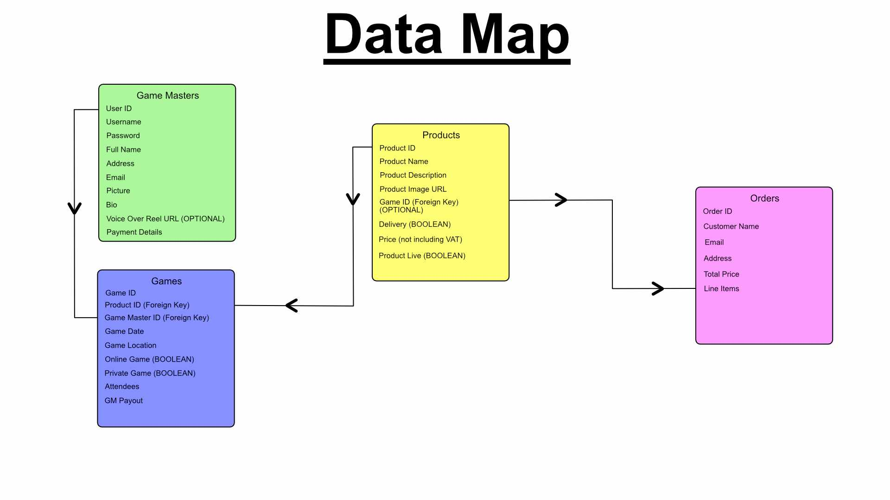

# Rolldark Game Master Agency

Rolldark Game Master Agency are a UK based company who provide paid Game Masters for Table Top Roleplaying Games both online and in person, as well as provide supplimentary products like Dice and Dungeons and Dragons modules for customers to run themselves.

The business currently uses a variety of third party solutions to run its website, which they have shown an interest in consolodating into one solution. They have mentioned several challenges they currently face, which they would like to resolve:

* Manual processing of invoices

Each Game Master working for Rolldark is self employed, and submits invoices monthly. Without unique reference numbers the Game Masters have to submit invoices with customer's email addresses as the identifying data, which has to be manually matched up by the accounts team for payment processing.

* Limited visibility of purchased tickets for online games

Game Masters currently have a shared spreadsheet that keeps them updated about who has purchased tickets to their games online, which has to be manually updated by the admin team. This is time consuming, and also means if a customer purchases tickets outside office hours the Game Master has no way of validating the payment has been received.

* Limited visibility of scheduled private games

Currently Game Masters organise their own calendars for private games, meaning they have to keep the admin team updated about any changes as they occur. This results in double handling of the data, as the admin team then have to update their own records to match which can lead to incorrect information if they are not updated with enough notice.

## Contents

* [User Experience](#user-experience)
    - [User Stories](#user-stories)
* [Design](#design)
    - [Color Scheme](#color-scheme)
    - [Typography](#typography)
    - [Imagery](#imagery)
    - [Wireframe](#wireframe)
    - [Database](#database)
* [Features](#features)
* [Accessibility](#accessibility)
* [Credits](#credits)
* [Technologies Used](#technologies-used)
    - [Languages Used](#languages-used)
    - [Frameworks, Libraries & Programs Used](#frameworks-libraries--programs-used)
* [Deployment and Local Development](#deployment-and-local-development)
    - [Deployment](#deployment)
    - [Local Development](#local-development)
* [Testing](#testing)
    - [Solved Bugs](#solved-bugs)
    - [Known Bugs](#known-bugs)
* [Credits](#credits)
    - [Code Used](#code-used)
    - [Media](#media)
    - [Acknowledgements](#acknowledgements)

## User Experience

### User Stories

| **End User Stories** | |
|:-------:|:-------:|
| **All Users** | I want the site to be responsive to my device |
| | I want the site to be easy to navigate |
| | I want to be able to check out quickly and easily if I make a purchase |
| | I want to be able to sort products according to my needs |
| **First Time User** | I want to quickly understand the services Rolldark Game Master Agency offer |
| | I want the user registration process to be quick and easy |
| **Returning User** | I want to be able to quickly navigate to the relevant part of the site for my needs |
| | I want the option to stay logged in for faster checkout |
| | I want the site to remember what games I have shown interest in before |
| **Frequent User** | I want to be able to find games that fit my schedule and budget |
| | I want to see what games I am currently signed up for |
|:-------:|:-------:|
| **Admin User Stories** | |
|:-------:|:-------:|
| **Game Scheduling** | I want the site to automatically respond to customers, confirming purchases |
| | I want Game Masters to be emailed simultaneously, notifying them of a new player in their game |
| | I want to be able to see at a glance how many players have purchased tickets for each game |
| **Private Games** | I want to be able to add private game details to the database |
| | I want to see if Game Masters make any changes to the date, time or venue for private games |
| **Accounts** | I want all purchases to have unique reference IDs for invoicing |
| | I want invoices generated by the system to automatically populate unique reference IDs |
| **Site Management** | I want to be able to add products to the site easily |
| | I want games that occured in the past to automatically be removed from the store page |
| | I want to be able to schedule products and blog posts to display on the site at an assigned date |
|:-------:|:-------:|
| **Game Master User Stories** | |
|:-------:|:-------:|
| **Game Scheduling** | I want to see all the games I have scheduled at a glance |
| | I want to be able to see who has purchased tickets to my games |
| | I want to be able to update game details for private games on the central database |
| **Invoicing** | I want to be able to automatically generate invoices based on games I have run |

---

## Design

### Database

As Rolldark currently uses multiple solutions to run their business, with many aspects of administration being handled manually; there is a lot of scope for improving efficiency by implementing a relational database. In addition to managing the storefront through the database, I thought a valuable addition would be the ability to manage Game Master invoices through the website's backend. It would solve several pain points for the business, simplifying the payments process and also allowing Game Masters to verify that customers have paid for the games they are playing.

